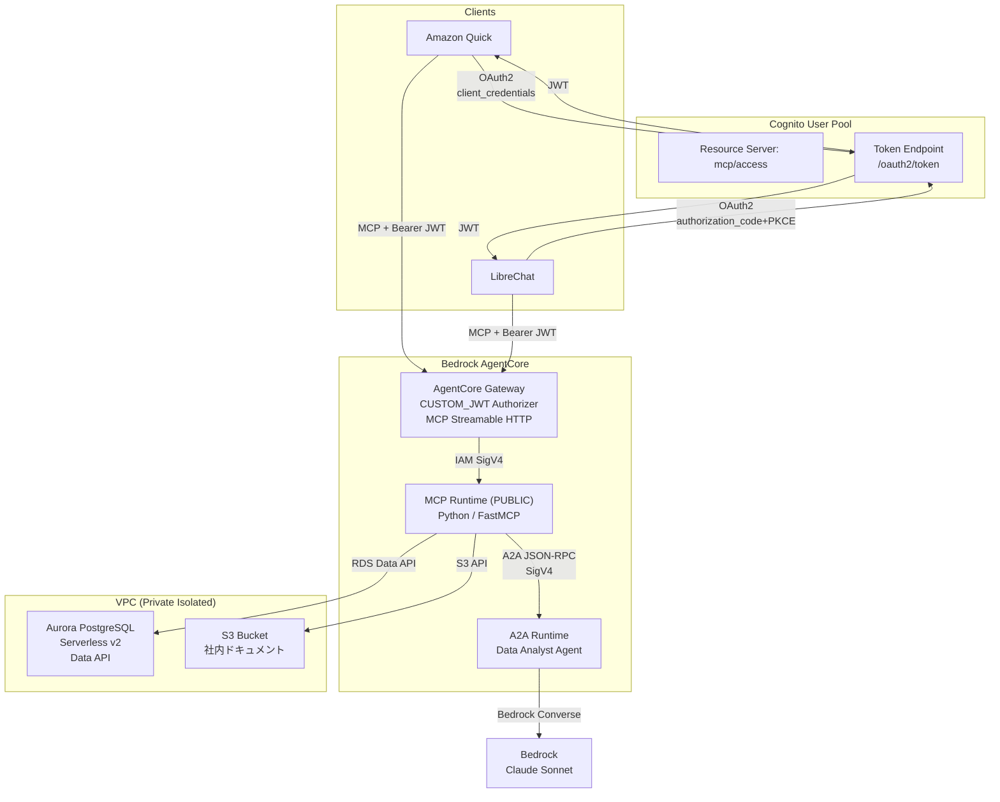
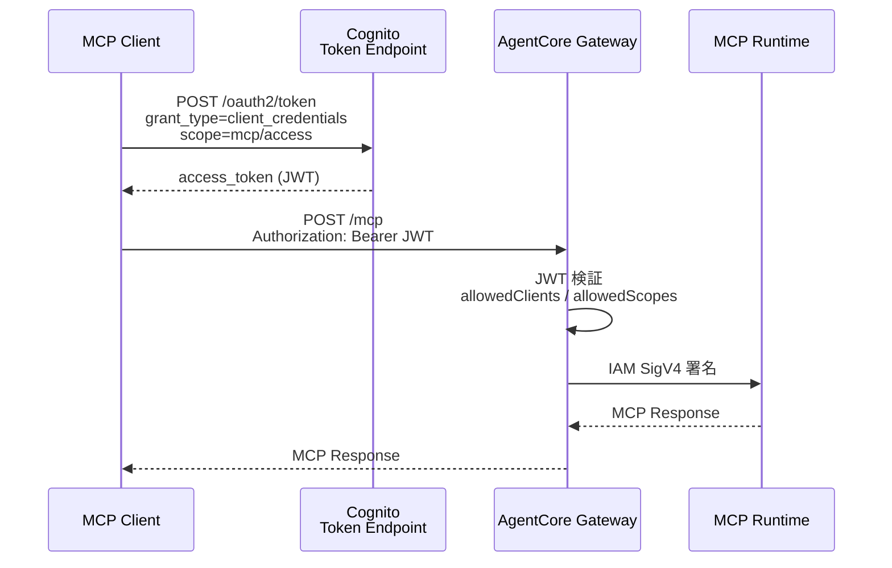

# Internal Business Agent Tools

社内の非公開データ（顧客DB、社内ドキュメント）に対して、自然言語で安全にアクセスできる AI エージェント基盤。

## 概要

ビジネスユーザーが Claude（Amazon Quick / LibreChat）を UI として利用し、AgentCore Gateway 経由で社内リソースに問い合わせる構成のサンプルです

## デモ


## アーキテクチャ



## サンプルのユースケース

| シナリオ | ユーザー入力例 | 利用ツール |
|---------|-------------|-----------|
| 顧客情報の検索 | 「契約金額1000万円以上のアクティブな顧客は？」 | `query_database` |
| プロジェクト状況の確認 | 「進行中のプロジェクトの予算一覧を見せて」 | `query_database` |
| 社内ポリシーの参照 | 「リモートワークのルールを教えて」 | `list_documents` → `get_document` |
| データ分析 | 「この顧客データの傾向を分析して」 | `query_database` → `ask_analyst` |

## サンプルのMCP ツール一覧

| ツール名 | 機能 | バックエンド |
|---------|------|------------|
| `query_database` | SQL (SELECT のみ) を実行 | Aurora PostgreSQL (Data API) |
| `list_documents` | ドキュメント一覧を取得 | S3 |
| `get_document` | ドキュメント内容を取得 | S3 |
| `ask_analyst` | A2A エージェントにデータ分析を依頼 | AgentCore Runtime 上のエージェント |


## CDK スタック構成

| Stack | リソース |
|-------|----------|
| `InternalAgent-Data` | VPC, Aurora Serverless v2, S3, Cognito UserPool, SSM Parameters, DB Seed |
| `InternalAgent-AgentCore` | ECR (import), CfnRuntime x2 (MCP + A2A), CfnGateway, CfnGatewayTarget |

## 認証フロー



## セットアップ

### 前提条件

- AWS アカウント (ap-northeast-1)
- Node.js 18+, Python 3.12+, uv, Docker
- AWS CDK v2

### デプロイ

```bash
cd cdk
npm install

# AWS profile / account を設定 (どちらか必須)
export AWS_PROFILE=<profile>            # 推奨: profile経由でCDK_DEFAULT_ACCOUNTを自動解決
# あるいは
export CDK_DEFAULT_ACCOUNT=<12-digit>
export AWS_ACCOUNT=$CDK_DEFAULT_ACCOUNT  # build-push スクリプトが参照
export AWS_REGION=ap-northeast-1

# コンテナイメージをビルド & プッシュ
./scripts/build-push.sh
./scripts/build-push-a2a.sh

# CDK デプロイ
npx cdk deploy --all
```

### 動作確認

`cdk deploy --all` 後に、チャット UI なしで CLI からスタック全体を検証できる。
Cognito Client Secret と CDK output を取得したうえで:

```bash
export ACCOUNT_ID=<12-digit-account-id>
export CLIENT_ID=<InternalAgent-Data output AuthClientId>
export CLIENT_SECRET=$(aws cognito-idp describe-user-pool-client \
  --user-pool-id <UserPoolId> --client-id ${CLIENT_ID} \
  --query 'UserPoolClient.ClientSecret' --output text)
export TOKEN_ENDPOINT="https://internal-agent-mcp-${ACCOUNT_ID}.auth.ap-northeast-1.amazoncognito.com/oauth2/token"
export GATEWAY_URL=<InternalAgent-AgentCore output GatewayUrl>

# アクセストークン取得
export TOKEN=$(curl -s -X POST "${TOKEN_ENDPOINT}" \
  -H "Content-Type: application/x-www-form-urlencoded" \
  -d "grant_type=client_credentials&client_id=${CLIENT_ID}&client_secret=${CLIENT_SECRET}&scope=mcp/access" \
  | python3 -c "import sys,json; print(json.load(sys.stdin)['access_token'])")

# 4つの MCP ツールを一覧
curl -s -X POST "${GATEWAY_URL}" \
  -H "Authorization: Bearer ${TOKEN}" -H "Content-Type: application/json" \
  -H "Accept: application/json, text/event-stream" \
  -d '{"jsonrpc":"2.0","id":1,"method":"tools/list","params":{}}'
```

### クライアント接続

| クライアント | 接続方式 | 認証フロー |
|------------|---------|-----------|
| Amazon Quick | Connectors → MCP | Service authentication (client_credentials) |
| LibreChat | `librechat.yaml` OAuth 設定 | authorization_code + PKCE |

## セキュリティ

| レイヤー | 保護方式 |
|---------|---------|
| Client → Gateway | Cognito JWT (OAuth 2.0) |
| Gateway → Runtime | IAM SigV4 |
| Runtime → Aurora | RDS Data API (IAM 認証) |
| Runtime → S3 | IAM ロール |
| DB アクセス制御 | SELECT 文のみ許可 + 危険キーワードブロック |
| ネットワーク | Private Isolated Subnet + VPC Endpoints |

## 注意事項

- Runtime は **PUBLIC mode 必須** — Gateway → Runtime の接続は AgentCore コントロールプレーン経由のため
- Cognito `client_credentials` トークンには `aud` claim が含まれない — Gateway の `allowedAudience` は設定しない
- LibreChat は Dynamic Client Registration 非対応 — `librechat.yaml` で OAuth 情報を事前設定
