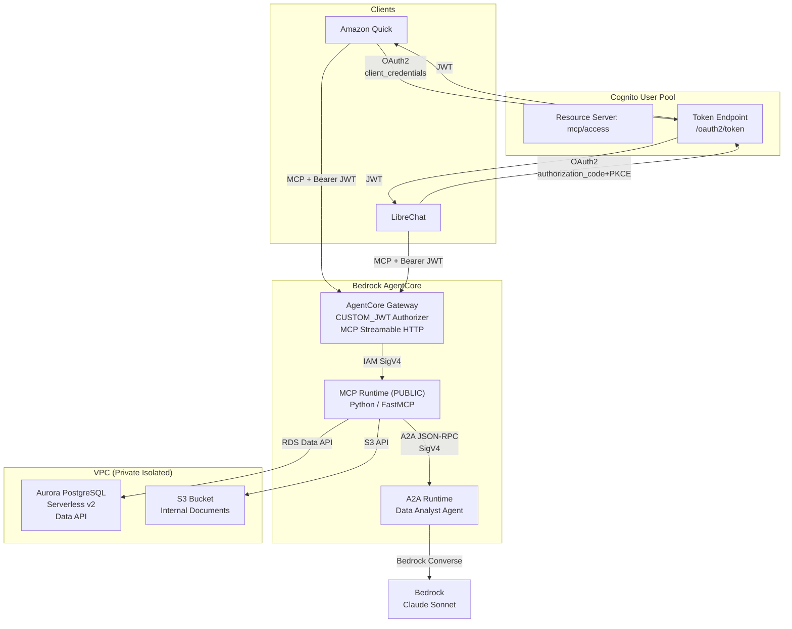
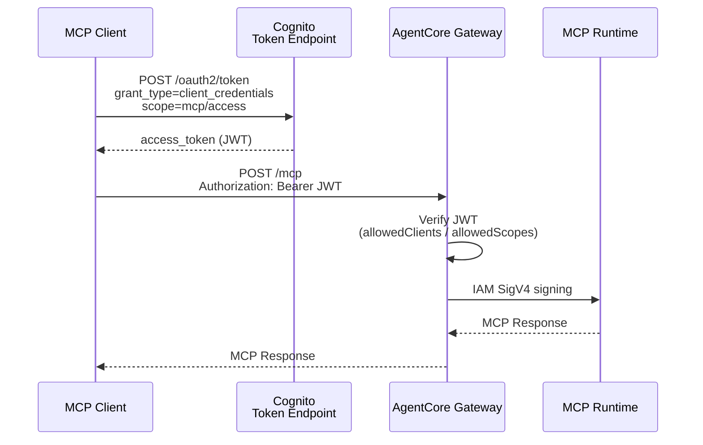

# Internal Business Agent Tools

A reference implementation for letting business users — including non-engineers — securely query private internal data (databases, documents) in natural language, through a server-side AWS-hosted agent stack instead of a desktop MCP client.

> Japanese version: [README.ja.md](README.ja.md)

## Why

When you want to roll out an "internal agent" for non-engineers, the typical desktop-MCP path forces each user to install a client, configure MCP/agent settings on their personal laptop, and route tool calls through out-of-region endpoints. This is hard to clear in internal security review and hard to explain to non-technical end users.

This repo packages an AWS-hosted alternative: an MCP server runs on AgentCore Runtime, is fronted by AgentCore Gateway with Cognito JWT auth, and is reachable from a regular chat UI (LibreChat, Amazon Quick) — so users only need a browser and an SSO login, with all data and tool execution kept inside AWS.

## Demo


## Architecture



## Use cases

| Scenario | Example user input | MCP tool used |
|---|---|---|
| Customer lookup | "Show active customers with contracts over 10M JPY" | `query_database` |
| Project status | "List in-progress internal projects with their budgets" | `query_database` |
| Policy reference | "What is the remote-work policy?" | `list_documents` → `get_document` |
| Data analysis | "Analyse trends in this customer dataset" | `query_database` → `ask_analyst` |

## MCP tools

| Tool | Purpose | Backend |
|---|---|---|
| `query_database` | Run a SELECT-only SQL query | Aurora PostgreSQL (Data API) |
| `list_documents` | List internal documents | S3 |
| `get_document` | Fetch a single document | S3 |
| `ask_analyst` | Delegate analysis to the A2A agent | Agent hosted on AgentCore Runtime |

## CDK stacks

| Stack | Resources |
|---|---|
| `InternalAgent-Data` | VPC, Aurora Serverless v2, S3, Cognito User Pool, SSM Parameters, DB seed |
| `InternalAgent-AgentCore` | ECR (import), CfnRuntime × 2 (MCP + A2A), CfnGateway, CfnGatewayTarget |

## Authentication flow



## Setup

### Prerequisites

- AWS account in `ap-northeast-1`
- Node.js 18+, Python 3.12+, [`uv`](https://docs.astral.sh/uv/), Docker
- AWS CDK v2

### Deploy

```bash
cd cdk
npm install

# Set AWS profile or account (one is required)
export AWS_PROFILE=<profile>            # Recommended: lets the CDK CLI populate CDK_DEFAULT_ACCOUNT for you
# Alternatively
export CDK_DEFAULT_ACCOUNT=<12-digit>
export AWS_ACCOUNT=$CDK_DEFAULT_ACCOUNT  # Used by the build-push scripts
export AWS_REGION=ap-northeast-1

# Build & push container images
./scripts/build-push.sh
./scripts/build-push-a2a.sh

# Deploy CDK
npx cdk deploy --all
```

### Verify

After `cdk deploy --all`, sanity-check the stack from the CLI (no chat UI needed).
Grab your Cognito client secret and the CDK outputs, then:

```bash
export ACCOUNT_ID=<12-digit-account-id>
export CLIENT_ID=<from InternalAgent-Data output AuthClientId>
export CLIENT_SECRET=$(aws cognito-idp describe-user-pool-client \
  --user-pool-id <UserPoolId> --client-id ${CLIENT_ID} \
  --query 'UserPoolClient.ClientSecret' --output text)
export TOKEN_ENDPOINT="https://internal-agent-mcp-${ACCOUNT_ID}.auth.ap-northeast-1.amazoncognito.com/oauth2/token"
export GATEWAY_URL=<from InternalAgent-AgentCore output GatewayUrl>

# fetch an access token
export TOKEN=$(curl -s -X POST "${TOKEN_ENDPOINT}" \
  -H "Content-Type: application/x-www-form-urlencoded" \
  -d "grant_type=client_credentials&client_id=${CLIENT_ID}&client_secret=${CLIENT_SECRET}&scope=mcp/access" \
  | python3 -c "import sys,json; print(json.load(sys.stdin)['access_token'])")

# list the 4 MCP tools
curl -s -X POST "${GATEWAY_URL}" \
  -H "Authorization: Bearer ${TOKEN}" -H "Content-Type: application/json" \
  -H "Accept: application/json, text/event-stream" \
  -d '{"jsonrpc":"2.0","id":1,"method":"tools/list","params":{}}'
```

### Connecting clients

| Client | Connection style | OAuth flow |
|---|---|---|
| Amazon Quick | Connectors → MCP | Service authentication (client_credentials) |
| LibreChat | OAuth in `librechat.yaml` | authorization_code + PKCE |

## Security

| Layer | Mechanism |
|---|---|
| Client → Gateway | Cognito JWT (OAuth 2.0) |
| Gateway → Runtime | IAM SigV4 |
| Runtime → Aurora | RDS Data API (IAM auth) |
| Runtime → S3 | IAM role |
| DB access guardrail | SELECT-only + destructive-keyword denylist |
| Network | Private isolated subnets + VPC Endpoints |

## Notes

- The Runtime **must run in PUBLIC mode** — Gateway → Runtime traffic goes through the AgentCore control plane, so VPC mode is unreachable.
- Cognito `client_credentials` JWTs do **not** include an `aud` claim — do not configure `allowedAudience` on the Gateway authorizer.
- LibreChat does not support OAuth Dynamic Client Registration; pre-configure the OAuth block in `librechat.yaml`.
- Bedrock invocation must use inference profile IDs (`jp.*`, `apac.*`), not direct model IDs.
